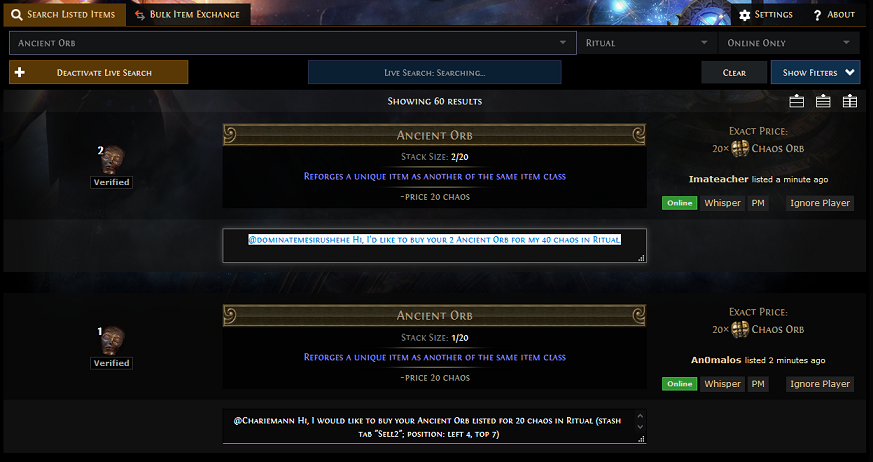

      _____   ____  ______   ____        _ _    
     |  __ \ / __ \|  ____| |  _ \      | | |   
     | |__) | |  | | |__    | |_) |_   _| | | __
     |  ___/| |  | |  __|   |  _ <| | | | | |/ /
     | |    | |__| | |____  | |_) | |_| | |   <
     |_|     \____/|______| |____/ \__,_|_|_|\_\

POE Bulk is a [bookmarklet][1] which enhance your trade with the official [POE trade website][2]. It is designed to help 
you to bulk a lot of items for selling them costly later. This is not a bot, you still have to work, but you will be 
quicker and doing it with efficiency.

Functionnality
--------------

- Adds a textarea under each trade with an accurate whisper
    - The lastest textarea added always gains the focus
    - Click on or focus on a textarea select all the text of the whisper
    - The color of the textarea will change if at least one copy is detected
- Updates the whisper when the item is updated
- Removes the textarea when the item is gone or outdated
- Works with "Search Listed Item" tab only
- Compatible with [POE Trades Companion][3] meaning copying the whisper will send it automatically in the game

Screenshot
----------

Installation
------------

1. Create a new bookmark in your navigator
2. Type a name of your choice in the label input
3. Copy and paste all [this text][4] in the URL input
4. Save

**Note:** no further update needed, the bookmarklet will always load the lastest version from this Github.

Start POE Bulk
--------------

1. Navigate to the [POE trade website][2]
2. Login if needed to be able to use the live search
3. Click on the bookmark
4. Fill the form with your criteria
5. Validate the form by clicking on the "Search" button
6. Click on the "Activate Live Search" button if needed
7. Copy and paste each whisper
8. Enjoy

**Note:** you have to click on the bookmark each time you open a new tab or navigate to a new URL in an existing tab.

Changelog
---------

The changelog history is available [here][5].

[1]: https://en.wikipedia.org/wiki/Bookmarklet
[2]: https://pathofexile.com/trade/search/
[3]: https://github.com/lemasato/POE-Trades-Companion
[4]: dist/bookmarklet.min.js
[5]: CHANGELOG.md
